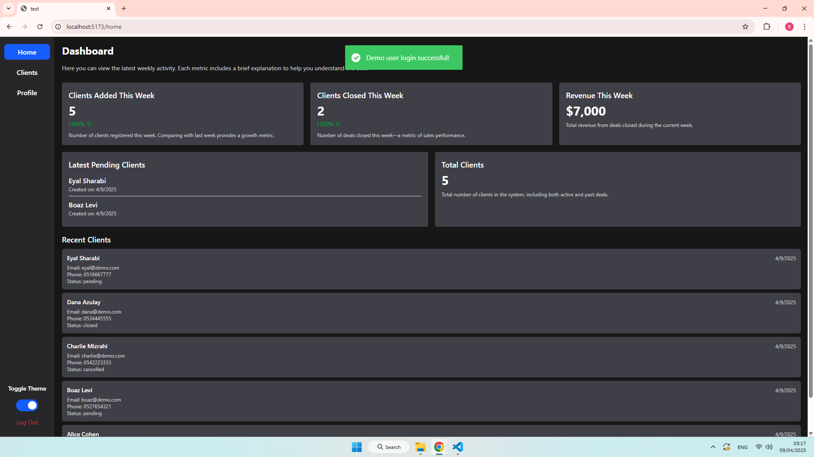
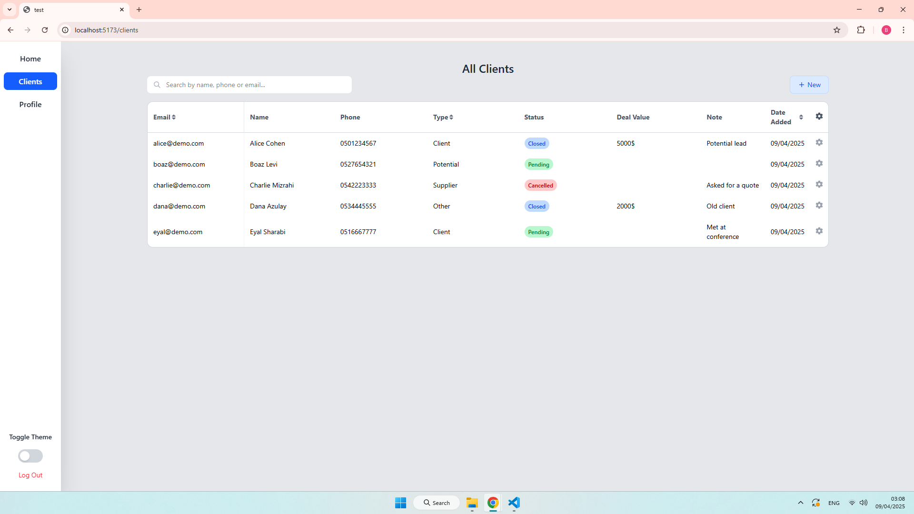
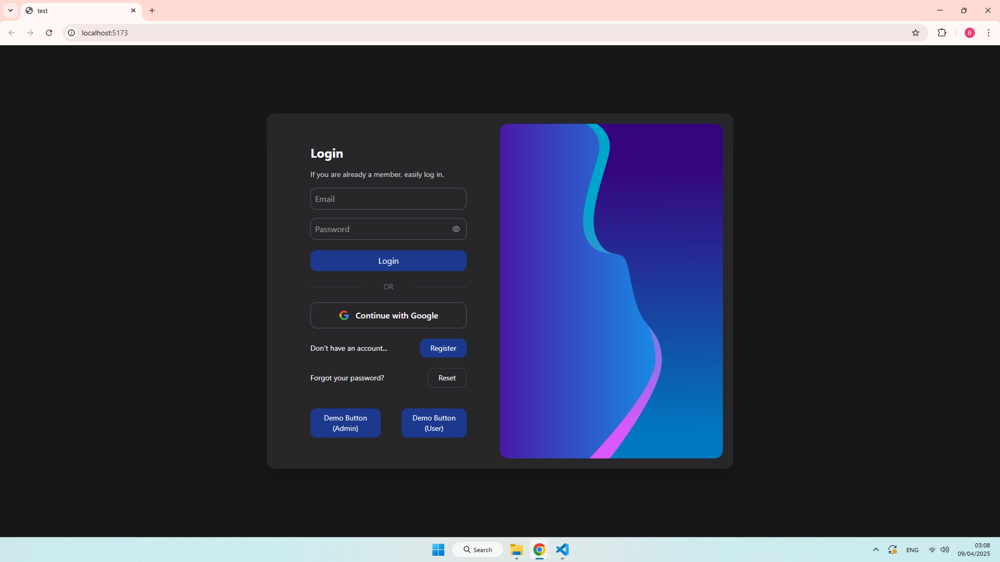

# CRM Dashboard

A modern and responsive CRM (Customer Relationship Management) web application built with React and Node.js. The system allows both regular users and administrators to manage clients, track activity, and analyze key business metrics.

> ✅ Includes demo admin and regular user accounts – no signup required!

🚀 **Live Demo:**
This app is hosted on Render (free tier). The backend may take up to 30 seconds to wake up after inactivity, during which a loading screen will be shown.
👉 [https://crm-dashboard-nu.vercel.app](https://crm-dashboard-nu.vercel.app)

---

## ✨ Features

### 🔑 Authentication
Secure login system using email and password with full validation.
- Google OAuth login
Easily sign in with your Google account using OAuth2.
- JWT-based authentication with protected routes
Ensures only authorized users can access specific parts of the system.
- Role-based access (admin / user)
Different dashboards and permissions depending on the user's role.
- Demo accounts for testing
Try the system without signing up using built-in admin and user.

### ⛔ Password Reset
Quick and secure recovery process through email verification codes.
- Valid for 5 minutes
- Secure password change with validation

### 📊 Dashboard
Track key performance indicators and gain insights in real-time. The layout and data dynamically adapt to the user's role.
#### Regular User:
- **Clients Added This Week** – Number of new clients the user added this week
- **Clients Closed This Week** – Number of deals the user successfully closed
- **Weekly Revenue** – Revenue from deals closed this week by the user
- **Pending Clients** – Clients currently awaiting follow-up or status update
- **Percentage change vs. previous week** – Weekly performance comparison

#### Admin:
- **Clients Added This Month** – Track the total new clients added by all users
- **Clients Closed This Month** – Number of deals closed across the system
- **Monthly Revenue** – Total revenue generated this month
- **Current Quarter Revenue** – Cumulative revenue for the current quarter
- **Average Monthly Deal** – Average deal value for the month
- **Recent Clients** – Latest clients added to the system (all users)
- **Percentage change vs. previous month/quarter** – Compare business growth over time

### 👥 User Management (Admin Only)
Admins can fully manage users: view, edit, delete, or change permissions.
- View all users
- Search, sort, edit, delete users
- View specific user profile
- Default admin is created automatically on startup

### 📅 Client Management
Robust client tracking with filtering, editing, and deal statistics.
- Add, edit, delete clients
- Admin sees all clients; users see only their own
- Fields: name, email, phone, type, note, status, deal value
- Filter by status, type, and creation date

### ✨ Additional Features
Quality-of-life improvements for better usability and user experience.
- Responsive design
- Dark mode based on system preference
- Protected routes for both UI and API
- Toast notifications with Notyf
- Demo data creation on first run (admin, user, sample clients)

---

## 🖼️ Screenshots

> Below are real screenshots from the system in action.

### User Dashboard (Dark Mode)


### Admin Dashboard (Light Mode)


### Clients Management


### Login Page (Dark Mode)


---

## 🧪 Demo Mode
Click "Demo Button (Admin)" or "Demo Button (User)" on the login page to explore the system without signing up.

---

## 📂 Technologies

### Frontend
- React + Vite
- TailwindCSS
- Axios
- React Router DOM
- Notyf
- React Icons
- react-oauth/google
- Date-fns

### Backend
- Node.js + Express
- MongoDB + Mongoose
- JWT
- Bcrypt
- Joi
- DotENV
- Nodemailer
- Axios (Google API)
- CORS
- Nodemon

---

## 📁 Project Structure

```
Root Directory
│
├── package.json
├── .gitignore
├── frontend
│   ├── vite.config.js
│   ├── package.json
│   ├── index.html
│   ├── eslint.config.js
│   ├── .gitignore
│   ├── .env
│   ├── public/
│   │   └── google-icon.svg
│   └── src/
│       ├── main.jsx
│       ├── index.css
│       ├── App.jsx 
│       ├── utils/
│       │   ├── AdminRoute.jsx
│       │   ├── AuthContext.jsx
│       │   ├── DarkMode.js
│       │   └── ProtectedRoute.jsx
│       ├── pages/
│       │   ├── Clients.jsx
│       │   ├── EditClient.jsx
│       │   ├── EditUser.jsx
│       │   ├── Home.jsx
│       │   ├── Login.jsx
│       │   ├── NotFound.jsx
│       │   ├── PasswordReset.jsx
│       │   ├── Profile.jsx
│       │   ├── Register.jsx
│       │   └── Users.jsx
│       ├── components/
│       │   ├── CreateClient.jsx
│       │   ├── ForgotPassword.jsx
│       │   ├── Loading.jsx
│       │   ├── ResetPassword.jsx
│       │   ├── SideBar.jsx
│       │   └── VerifyOtp.jsx
│       └── assets/
│           └── test.png
│
└── backend
    ├── package.json
    ├── .gitignore
    ├── .env
    └── src/
        ├── index.js
        ├── utils/
        │   ├── DemoData.js
        │   ├── passwordUtils.js 
        │   └── sendOtpEmail.js
        ├── routes/
        │   ├── userRoutes.js
        │   ├── clientRoutes.js
        │   ├── authRoutes.js 
        │   └── adminRoutes.js
        ├── models/
        │   ├── userModel.js
        │   └── clientModel.js
        ├── middleware/
        │   └── authMiddleware.js
        ├── controllers/
        │   ├── userController.js
        │   ├── clientController.js
        │   ├── authController.js 
        │   └── adminController.js
        └── config/
            └── dbConfig.js
```


---

## 🚀 Installation & Setup

### 1. Clone the repository
```bash
git clone https://github.com/barak7821/crm-dashboard.git
```

### 2. Navigate into the project folder
```bash
cd crm-dashboard
```

### 3. Install dependencies (from root folder)
```bash
npm install
```
This installs both frontend and backend via npm-run-all.

### 4. Create environment files

#### Backend `.env`
```env
PORT=your_port
MongoDB_URL=your_mongodb_connection_url
JWT_SECRET=your_jwt_secret_key
APP_NAME=CRM Dashboard
EMAIL_USER=your_email@example.com
EMAIL_PASS=your_email_app_password
```

#### Frontend `.env`
```env
VITE_BACKEND_URL=your_backend_url
VITE_GOOGLE_CLIENT_ID=your_google_client_id
```

### 5. Run the application
```bash
npm run dev
```
This will start both the backend and frontend servers concurrently using **npm-run-all** and **concurrently**. 
Make sure to run this command from the **main project folder**, not from the `frontend/` or `backend/` subfolders. 
The frontend output will be shown in blue, and the backend in green.